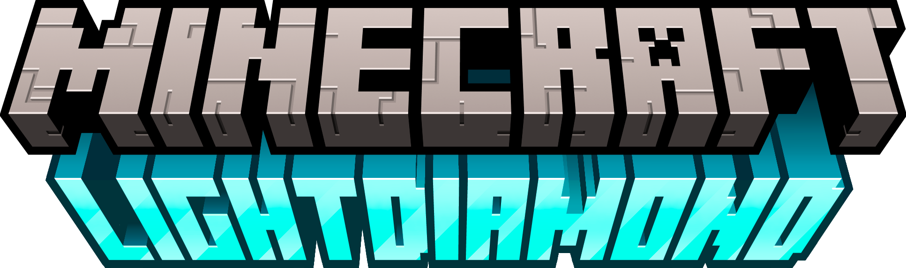

  <picture>
    <source media="(prefers-color-scheme: dark)" srcset="public/images/elements/light-diamond-logo.png?raw=true">
    
  </picture>

## Light Diamond Website

Давайте творить для Minecraft!
Наша цель — создать сплочённое творческое Сообщество вокруг нашей любимой Игры!

## Установка

Для начальной настройки проекта следует выполнить следующие шаги:

1. Убедитесь, что у Вас установлена и открыта актуальная версия Docker;
2. Скачайте репозиторий, распакуйте, перейдите в корень проекта;
3. Запустите скрипт `setup.sh`, введите секретные данные, когда скрипт их запросит, дождитесь окончания выполнения скрипта;

Запуск приложения осуществляется с помощью команды `docker compose up -d`.

Для остановки приложения используется команда `docker compose down`.
